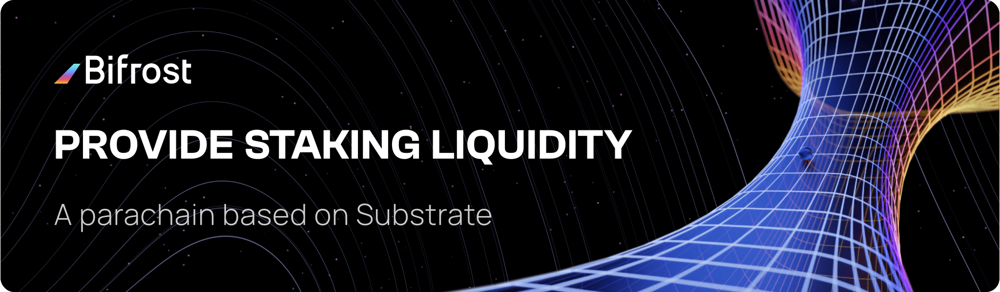

<a href="https://bifrost.finance"></a>

<a href="https://bifrost.finance"></a>

<h1 align="left"><a href="https://bifrost.finance">Homepage</a></h1>

Welcome,

Bifrost is a DeFi protocol to provide derivative for pledged assets.

👉 *Discover the Bifrost project at [bifrost.finance](https://bifrost.finance/).*  
👉 *Learn to use the Bifrost network with our [technical docs](https://wiki.bifrost.finance/devops).*  

<h4>🐣 Supported by</h4>

<p align="left">
  <a href="https://web3.foundation/grants"></a>
  <a href="https://www.substrate.io/builders-program"></a>
  <a href="https://bootcamp.web3.foundation/"></a>
</p>

[](https://github.com/bifrost-finance/bifrost/actions)
[](https://www.codacy.com/gh/bifrost-finance/bifrost?utm_source=github.com&amp;utm_medium=referral&amp;utm_content=bifrost-finance/bifrost&amp;utm_campaign=Badge_Grade)
[](https://github.com/paritytech/substrate)
[](https://hub.docker.com/repository/docker/bifrostnetwork/bifrost)
[](https://github.com/bifrost-finance/bifrost/blob/master/LICENSE)
[](https://t.me/bifrost_finance)
[](https://twitter.com/bifrost_finance)
[](https://medium.com/bifrost-finance)

## Install Rust and required tools

```bash
curl https://sh.rustup.rs -sSf | sh
make init
```

## Build binary

```bash
make build-all-release
```

## Testing

```bash
make test-all
```

## Generate runtime weights

if runtime logic change we may do the benchmarking to regenerate WeightInfo for dispatch calls

```bash
make run-benchmarking
```

## Testing runtime migration

If modify the storage, should test the data migration before production upgrade.

```bash
make try-bifrost-runtime-upgrade
```

## Run development chain

```bash
RUST_LOG=debug cargo run -p node-cli --locked --features "with-dev-runtime" -- --tmp --dev 
```

## Run local testnet with polkadot-launch

### Install `polkadot-launch`

```bash
yarn global add polkadot-launch
cd -
```

### Build polkadot

```bash
git clone -n https://github.com/paritytech/polkadot.git /tmp/polkadot
cd /tmp/polkadot
git checkout release-v0.9.9
cargo build --release
cd -
```

### Launch Polkadot and the parachain

```bash
cd -
polkadot-launch ./scripts/bifrost-launch.json
```

It will take about 1-2 minutes for the parachain to start producing blocks.

## Run local testnet with parachain-launch

### Install `parachain-launch`

```sh
yarn global add @open-web3/parachain-launch
```

### Generate docker files

```sh
parachain-launch generate --config=scripts/bifrost-docker-launch.yml --yes
```

It will pull images and generate required docker files in a folder called `output` in your current working directory

### Start relaychain and parachain

To start the nodes, navigate to the output folder that the generated docker scripts in and start containers:

```sh
cd ./output
docker-compose up -d --build
```

## Run full node with docker

### Create `bifrost-fullnode` directory, generate `node-key` and get `bifrost.json`

```sh
mkdir -p ~/bifrost-fullnode/network
subkey generate-node-key --file ~/bifrost-fullnode/network/node-key
wget -O ~/bifrost-fullnode/bifrost.json https://github.com/bifrost-finance/bifrost/releases/download/bifrost-v0.8.0/bifrost.json
```

### Start the node with docker

Replace your-fullnode-name
```sh
docker pull bifrostnetwork/bifrost:v0.8.3
docker run -d \
-v ~/bifrost-fullnode:/bifrost \
-p 9944:9944 \
-p 9933:9933 \
-p 30333:30333 \
-p 9615:9615 \
bifrostnetwork/bifrost:v0.8.3 \
  --name your-fullnode-name \
  --base-path "/bifrost" \
  --node-key-file "/bifrost/network/node-key" \
  --chain "/bifrost/bifrost.json" \
  --parachain-id 2001 \
  --pruning=archive \
  --prometheus-external \
  --rpc-external \
  --ws-external \
  --rpc-cors all \
  --execution wasm
```