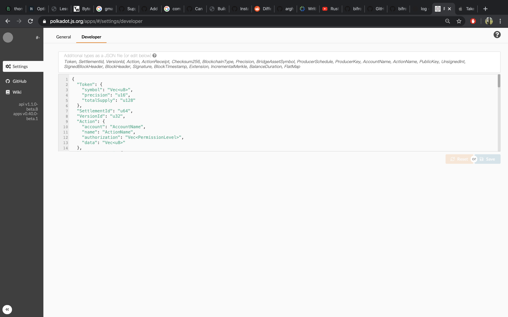

## All related repotories
- [bifrost](https://github.com/bifrost-codes/bifrost) (branch: ark-bridge-module)
- [bifrost-eos-relay](https://github.com/bifrost-codes/bifrost-eos-relay) (branch: bridge-plugin)
- [bifrost-eos-contracts](https://github.com/bifrost-codes/bifrost-eos-contracts) (branch: master)
- [rust-eos](https://github.com/bifrost-codes/rust-eos) (branch: use-rust-secp256k1)

## Bifrost

### 1. Compile
Follow the [readme](https://github.com/bifrost-codes/bifrost/tree/ark-bridge-module) to compile a bifrost node.
```
$ git clone https://github.com/bifrost-codes/bifrost.git
$ git checkout ark-bridge-module
$ cargo build --release
```

### 2. Run

Start two Bifrost nodes.

```
$ ./target/release/bifrost-node --base-path /tmp/alice \
--rpc-port 4321 \
--ws-port 9944 \
--chain=local \
--alice \
--port 30333 \
--node-key 0000000000000000000000000000000000000000000000000000000000000001 \
--telemetry-url ws://telemetry.polkadot.io:1024 \
--validator --execution Native
```

```
$ ./target/release/bifrost-node --base-path /tmp/bob \
--rpc-port 1234 \
--ws-port 9933 \
--bootnodes /ip4/127.0.0.1/tcp/30333/p2p/QmRpheLN4JWdAnY7HGJfWFNbfkQCb6tFf4vvA6hgjMZKrR \
--chain=local \
--bob \
--port 30334 \
--telemetry-url ws://telemetry.polkadot.io:1024 \
--validator --execution Native
```

Ensure both node are producing blocks and synchronizing each other.

## EOS

### 1. EOS runtime installation
Follow the instructions to install [eosio](https://developers.eos.io/eosio-home/docs/setting-up-your-environment)

---

### 2. Create a dev wallet

- Follow the instructions to create wallet [Create Development Wallet](https://developers.eos.io/eosio-home/docs/wallets).


**Tips**: 
> for the step 1, use the following command in case you forget the passoword
```
$ cleos wallet create --to-file
```

> The wallet folder will created under ```~/eosio-wallet```. If you forget the password to unclock the wallet, use the commands.
```
$ cat ~/eosio-wallet/default.pass # that will show the password
$ cleos wallet unlock # prompt you input the password
```
---

### 3. Compile and run eos node

#### Prerequisites
- Cmake
- LLVM@4.0
- Rust(better use latest stable rust)
- CDT(Contract Development Toolkit). Follow this tutorial to install [cdt](https://developers.eos.io/eosio-home/docs/installing-the-contract-development-toolkit).

#### Compile

```
$ git clone -b bridge-plugin https://github.com/bifrost-codes/eos
$ git submodule update --init --recursive
$ cd eos/
$ make build && cd build
$ cmake ..
$ make -j4
```

#### Run

The script: **start-producer.sh** && **start-relay.sh**.

Modify the script and find out **BIN_DIR** and **BASE_DIR**, point to your EOS project.

- Start block producer.
This node producers blocks.

```
$ ./start-producer.sh
```

- Start a EOS relay node.

This node is responsible for message sending like merkle root verification data, and surely synchronize blocks from block producers.
You have to modify this shell script before start this service.

Start it.
```
$ ./start-relay.sh
```

**Tips**: 
> If you get a error like dirty database,
```
rethrow "state" database dirty flag set: 
    {"what":"\"state\" database dirty flag set"}
    thread-0  chain_plugin.cpp:958 plugin_initialize
```

> or want to delete all histoty blocks, run the following command.
```shell
$ ./build/bin/nodeos --delete-all-blocks --delete-state-history --delete-relay-history --plugin eosio::bridge_plugin
```

---

### 4. Compile && Deploy contract

#### Compile
```
$ git clone https://github.com/bifrost-codes/bifrost-eos-contracts
$ cd bifrost-eos-contracts
$ make build && cd build
$ cmake ..
$ make -j4
```
The abi and wasm file will generated under folder **build/contracts/bifrost.bridge**, 
files like **bifrost.bridge.abi**, **bifrost.bridge.wasm**.

#### Deployment
The script: **deploy_contracts.sh**

What the script will do:

- Deploy contract.
- Creates two accounts for testing, **jim** and **bifrost**.
- Issue 10000.0000 EOS to jim.

Modify the script.
- Line 7, point to eos project.
- Line 13, point to bifrost-eos-contracts project.

Execute it.
```shell
$ ./deploy_contracts.sh
```
It should run without errors.

**Tips**:
> If you get error like 
```
Error 3120003: Locked wallet
Ensure that your wallet is unlocked before using it!
Error Details:
You don't have any unlocked wallet!
```
Go back to section **Create a dev wallet**'s tips to unlock the wallet.

## Testing

### Configure Browser

Go to [polkadot.js.org](https://polkadot.js.org/apps/#/settings/developer), Copy content data from the file ```developer_setting.json``` to **Deveoper** tab like this, and save it.


### EOS to Bifrost

Before you send a transaction to Bifrost, check **jim**'s and **bifrost**'s balance.

```
# should print 10000.0000 EOS
$ cleos get currency balance eosio.token jim

# bifrost is contract account, should print nothing
$ cleos get currency balance eosio.token bifrost
```

Now send a transaction.
```
$ cleos push action eosio.token transfer '["jim", "bifrost", "100.0000 EOS", "alice@bifrost:EOS"]' -p jim@active
```

Go to [polkadot.js.org](https://polkadot.js.org/apps/#/extrinsics), to check whether transaction is sent successfully to Bifrost or not.

Wait about 90 seconds for the transaction is verified. If all go well, you can see a event like the following screencapture.


If you see that figure above, go check **jim**'s and **bifrost**'s balance again.
```
# should print 9900.0000 EOS
$ cleos get currency balance eosio.token jim

# should print 100.0000 EOS
$ cleos get currency balance eosio.token bifrost
```

### Bifrost to EOS

Before testing, you have to setup some nessary steps.

- Multisignature Configuration

Bifrost side:

There're two Bifrost nodes that you start in previous steps, here you need add EOS node address info and EOS secret key
to both running Bifrost nodes by tool **subkey**.

Add EOS info to one Bifrost node(port: 4321).

```
# add eos node address where you start start eos service
$ ./target/release/subkey localstorage-set EOS_NODE_URL http://127.0.0.1:8888/ http://127.0.0.1:4321/ 

# add account testa secret key to Bi
$ ./target/release/subkey localstorage-set EOS_SECRET_KEY 5KDXMiphWpzETsNpp3eL3sjWAa4gMvMXCtMquT2PDpKtV1STbHp http://127.0.0.1:4321/
```

Add EOS info to the other Bifrost node(port: 1234).

```
$ ./target/release/subkey localstorage-set EOS_NODE_URL http://127.0.0.1:8888/ http://127.0.0.1:1234/

$ ./target/release/subkey localstorage-set EOS_SECRET_KEY 5JNV39rZLZWr5p1hdLXVVNvJsXpgZnzvTrcZYJggTPuv1GzChB6 http://127.0.0.1:1234/
```

EOS side:

```
$ cleos set account permission bifrost active '{"threshold":2,"keys":[],"accounts":[{"permission":{"actor":"testa","permission":"active"},"weight":1}, {"permission":{"actor":"testb","permission":"active"},"weight":1}, {"permission":{"actor":"testc","permission":"active"},"weight":1}, {"permission":{"actor":"testd","permission":"active"},"weight":1}]}' owner
```

After you set permission for account bifrost, try this command to verify the result.
```
$ cleos get account bifrost
```

It should print some info like this.

```
permissions: 
     owner     1:    1 EOS6MRyAjQq8ud7hVNYcfnVPJqcVpscN5So8BhtHuGYqET5GDW5CV
        active     2:    1 testa@active, 1 testb@active, 1 testc@active, 1 testd@active
```

Now, we can send a transaction to EOS node.

In present, we cannot trigger a transaction on [polkadot.js.org](https://polkadot.js.org/apps/#/extrinsics), but there's a temporary solution for it.

The subkey has a sub-command that can send a transaction from bifrost node to EOS node.

```
# 127.0.0.1:9944 is a bifrost node websocket address 
$ ./target/release/subkey send_transaction jim 1 127.0.0.1:9944
```

Check jim's and bifrost's balance in EOS node if it runs without error.

```
# should print 9901 EOS
$ cleos get currency balance eosio.token jim

# should print 99 EOS
$ cleos get currency balance eosio.token bifrost
```