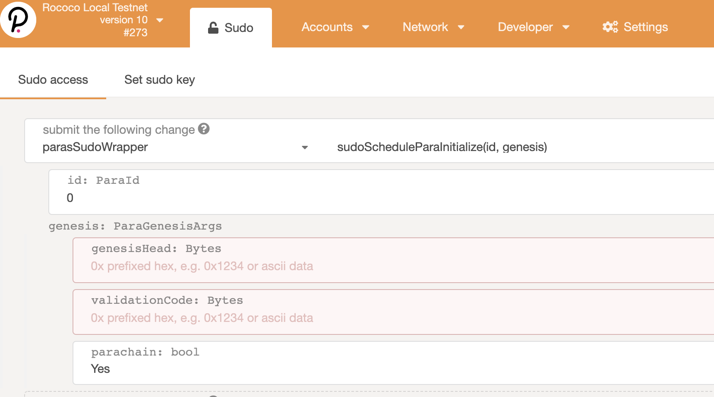

## Relay chain setup

1. Build relay chain.
```
git clone https://github.com/paritytech/polkadot.git
cd polkadot
cargo build --release --features=real-overseer
```
2. Generate relay chain spec.
```
./target/release/polkadot build-spec --chain rococo-local --disable-default-bootnode --raw > rococo-relay-chain-spec.json
```
3. Start two relay chain nodes.
```
# alice node
./target/release/polkadot \
--chain rococo-local \
--alice \
--base-path /tmp/alice \
--rpc-cors 'all' \
--unsafe-ws-external \
--discover-local

# bob node
./target/release/polkadot \
--chain rococo-local \
--bob \
--base-path /tmp/bob \
--rpc-cors 'all' \
--unsafe-ws-external \
--discover-local \
--ws-port 9945 \
--port 30335
```

Ensure both nodes produce blocks.

## Parachain setup
1. Build para chain.
```
git clone https://github.com/bifrost-finance/bifrost.git
git checkout develop
cargo build --release
```
2. Genrate genesis state file with parachain id 107.
```
./target/release/bifrost export-genesis-state --parachain-id 107 --chain rococo-local > para-107-state
```
3. Generate genesis wasm file.
```
./target/release/bifrost export-genesis-wasm --raw --chain rococo-local > para-107-wasm
```
4. Start a para chain node with parachain id 107.
```shell
./target/release/bifrost \
--tmp \
--chain rococo-local \
--ws-port 9979 \
--port 30438 \
--parachain-id 107 \
--validator \
--bob \
-- \
--chain rococo-relay-chain-spec.json \
--discover-local
```
5. Register para chain you just start. Visit [polkadot-js](https://polkadot.js.org/apps/#/extrinsics), follow this figure to register para chain.

> Tips: If you the website cannot be rendered, just open the console of browser, see what kind of error is showed, basiclly, there should be some type definitions that are not added.


Input both files that you generate from step 2 and 3, para chain id as 107.



After succeed in regisration , it should print logs like from parachain.
```
2020-11-20 14:58:07  Starting collation for relay parent `0x4d3f…a862` on parent `0x1789…0c63`.
2020-11-20 14:58:07  🙌 Starting consensus session on top of parent 0x17897d411ea30347668c3ffa60353c04a21c60ea4631296f810520ef81b00c63
2020-11-20 14:58:07  🎁 Prepared block for proposing at 1 [hash: 0x5b0ee62786b06f4c968c6ec37011abdd815f424c5f3fe5bd5f8e8512dfd6aff3; parent_hash: 0x1789…0c63; extrinsics (2): [0x3c92…78d5, 0x7e3b…b8f0]]
2020-11-20 14:58:07  Produced proof-of-validity candidate `0xcdb8e40765a1677af69f3ab2971f6ca62e4c0fac86898feb2c7d5f73187ce05f` from block `0x5b0ee62786b06f4c968c6ec37011abdd815f424c5f3fe5bd5f8e8512dfd6aff3`.
2020-11-20 14:58:07  ✨ Imported #1 (0x5b0e…aff3)
```

Parachain should gets stuck at producing block 1, it's expected.

6. You have to wait for 10 minutes at most, but it depends. If all go smoothly, you should see that parachain produces blocks and sychronizes blocks from relay chain.
```
2020-11-20 16:06:32  💤 Idle (0 peers), best: #78 (0xed3c…9861), finalized #77 (0xaa20…e807), ⬇ 0.4kiB/s ⬆ 0.4kiB/s
2020-11-20 16:06:36  ✨ Imported #457 (0x9cde…043a)
2020-11-20 16:06:36  Starting collation for relay parent `0x9cde…043a` on parent `0xed3c…9861`.
2020-11-20 16:06:36  🙌 Starting consensus session on top of parent 0xed3ceb709712199281c57905fa317f4a25e93a2e23a88c9f7cbddec288b19861
2020-11-20 16:06:36  🎁 Prepared block for proposing at 79 [hash: 0xd0d8e7d0c23326843de7591c68d4c14a0bd1947a50d7ffbd93d44593d4a79687; parent_hash: 0xed3c…9861; extrinsics (2): [0xb756…d7ac, 0xd492…2233]]
2020-11-20 16:06:36  ✨ Imported #79 (0xd0d8…9687)
2020-11-20 16:06:36  Produced proof-of-validity candidate `0x4ec3a19cbb5d249ba4283710f6c5fdd139c33be7667bb6259ea6c0995c0d9726` from block `0xd0d8e7d0c23326843de7591c68d4c14a0bd1947a50d7ffbd93d44593d4a79687`.
2020-11-20 16:06:36  💤 Idle (2 peers), best: #457 (0x9cde…043a), finalized #454 (0xb318…d80d), ⬇ 1.1kiB/s ⬆ 2.6kiB/s
```
> Tips: Block 79 is produced by parachain, block 457 is sychronized from relay chain.