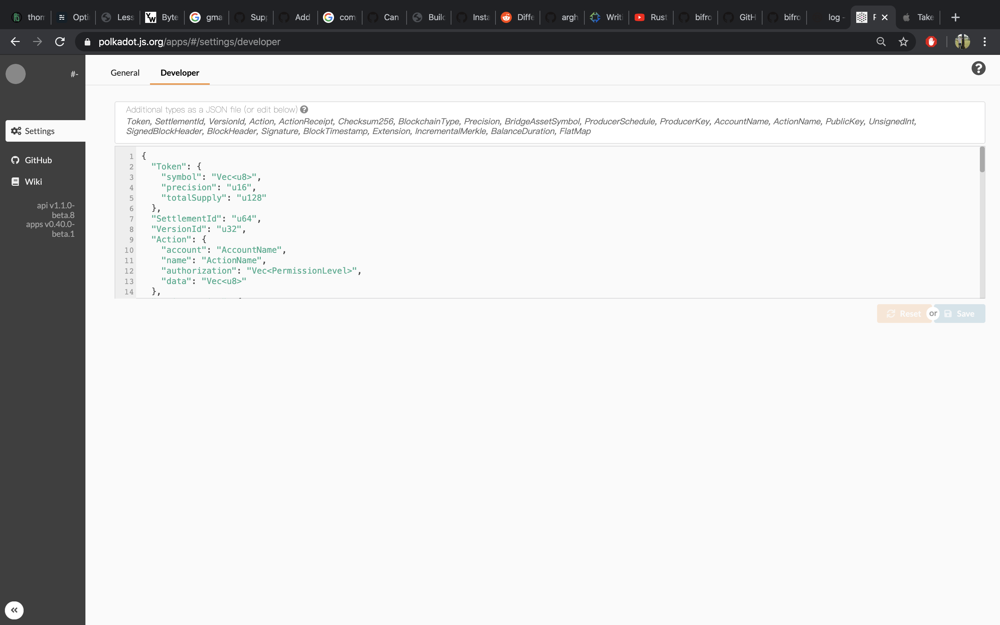

## All related repotories
- [bifrost](https://github.com/bifrost-finance/bifrost) (branch: master)
- [bifrost-eos-relay](https://github.com/bifrost-finance/bifrost-eos-relay) (branch: bridge-plugin)
- [bifrost-eos-contracts](https://github.com/bifrost-finance/bifrost-eos-contracts) (branch: master)
- [rust-eos](https://github.com/bifrost-finance/rust-eos) (branch: use-rust-secp256k1)

## Bifrost

### 1. Pull the image
```
$ docker pull bifrostnetwork/bifrost:web3_m1
```

### 2. Run nodes

Start two Bifrost nodes.

Alice node: 
```
$ docker run --name=alice -p 9944:9944 -p 4321:4321 bifrostnetwork/bifrost:web3_m1 --base-path /tmp/alice \
--unsafe-rpc-external \
--rpc-port 4321 \
--rpc-cors all \
--unsafe-ws-external \
--ws-port 9944 \
--chain=dev \
--alice \
--port 30333 \
--node-key 0000000000000000000000000000000000000000000000000000000000000001 \
--validator --execution Native
```

Bob node:
```
$ docker run --name=bob -p 9933:9933 -p 1234:1234 bifrostnetwork/bifrost:web3_m1 --base-path /tmp/bob \
--unsafe-rpc-external \
--rpc-cors all \
--rpc-port 1234 \
--unsafe-ws-external \
--ws-port 9933 \
--bootnodes /ip4/127.0.0.1/tcp/30333/p2p/QmRpheLN4JWdAnY7HGJfWFNbfkQCb6tFf4vvA6hgjMZKrR \
--chain=dev \
--bob \
--port 30334 \
--validator --execution Native
```

Ensure both node are producing blocks and synchronizing each other.

Execute the following command to get internal ip for next step.
```
docker inspect alice
```
It should like this.


## EOS

### 1. EOS runtime installation
Follow the instructions to install [eosio](https://developers.eos.io/eosio-home/docs/setting-up-your-environment)

---

### 2. Create a dev wallet

**Tips**: 
> While you're creating wallet, use the following command in case you forget the passoword
```
# do not use cleos wallet create --to-console
$ cleos wallet create --to-file
```

- Follow the instructions to create wallet [Create Development Wallet](https://developers.eos.io/eosio-home/docs/wallets).


> The wallet folder will created under ```~/eosio-wallet```. If you forget the password but you have to unclock the wallet, use the following commands.
```
$ cat ~/eosio-wallet/default.pass # that will show the password
$ cleos wallet unlock # prompt you input the password
```
---

### 3. Run EOS nodes
Pull image
```
$ docker pull bifrostnetwork/bifrost-eos-relay:v2.0.4.web3
```

start producer node
```
$ docker run --name=producer -p 8888:8888 -p 9876:9876 bifrostnetwork/bifrost-eos-relay:v2.0.4.web3 --max-transaction-time=1000 \
--enable-stale-production \
--producer-name eosio \
--plugin eosio::chain_api_plugin \
--plugin eosio::net_api_plugin \
--plugin eosio::producer_api_plugin \
--p2p-server-address=0.0.0.0:9876 \
--http-server-address=0.0.0.0:8888 \
--http-alias=nodeos:8888 --http-alias=127.0.0.1:8888 --http-alias=localhost:8888 \
--config-dir /home/localnet/node/producer/config \
--data-dir /home/localnet/node/producer/data -l /home/localnet/node/producer/logging.json
```
then get the internal ip from the running container
```
docker inspect producer
```
Now, replace [eos_producer_internal_ip] and [bifrost_internal_ip] with the ip you get, start a relay node.
```
docker run --name=relayer -p 8889:8889 -p 9877:9877 bifrostnetwork/bifrost-eos-relay:v2.0.4.web3 --plugin eosio::chain_api_plugin \
--plugin eosio::bridge_plugin \
--plugin eosio::http_plugin \
--http-server-address 0.0.0.0:8889 \
--p2p-listen-endpoint 0.0.0.0:9877 \
--p2p-peer-address [eos_producer_internal_ip]:9876 \
--config-dir /home/localnet/node/relay/config \
--data-dir /home/localnet/node/relay/data -l /home/localnet/node/relay/logging.json \
--bifrost-node=[bifrost_internal_ip]:9944 \
--bifrost-crossaccount=bifrostcross \
--bifrost-signer=//Alice
```
Both nodes should be sychronizing each other.

---

### 4. Compile && Deploy contract

#### Compile
```
$ git clone https://github.com/bifrost-finance/bifrost-eos-contracts
$ cd bifrost-eos-contracts
$ mkdir build && cd build
$ cmake ..
$ make -j4
```
The abi and wasm file will generated under folder **build/contracts/bifrost.bridge**, 
files like **bifrost.bridge.abi**, **bifrost.bridge.wasm**.

#### Deployment
The script: **deploy_contracts.sh**

What the script will do:

- Deploy contract.
- Creates two accounts for testing, **jim** and **bifrost**.
- Issue 10000.0000 EOS to jim.

Modify the script.
- Line 7, point to eos project.
- Line 13, point to bifrost-eos-contracts project.

Execute it.
```shell
$ ./deploy_contracts.sh
```
It should run without error.

**Tips**:
> If you get error like 
```
Error 3120003: Locked wallet
Ensure that your wallet is unlocked before using it!
Error Details:
You don't have any unlocked wallet!
```
Go back to section **Create a dev wallet**'s tips to unlock the wallet.

## Testing

### Configure Browser

Go to [polkadot.js.org](https://polkadot.js.org/apps/#/settings/developer), Copy content data from the file ```developer_setting.json``` to **Deveoper** tab like this, and save it.


### EOS to Bifrost

Before you send a transaction to Bifrost, check **jim**'s and **bifrostcross**'s balance.

```
# should print 10000.0000 EOS
$ cleos get currency balance eosio.token jim

# bifrost is contract account, should print nothing
$ cleos get currency balance eosio.token bifrostcross
```

Now send a transaction.
```
$ cleos push action eosio.token transfer '["jim", "bifrostcross", "100.0000 EOS", "5GrwvaEF5zXb26Fz9rcQpDWS57CtERHpNehXCPcNoHGKutQY@bifrost:vEOS"]' -p jim@active
```
**5GrwvaEF5zXb26Fz9rcQpDWS57CtERHpNehXCPcNoHGKutQY** is Alice, surely you can use Bob(5FHneW46xGXgs5mUiveU4sbTyGBzmstUspZC92UhjJM694ty),
Dave(5DAAnrj7VHTznn2AWBemMuyBwZWs6FNFjdyVXUeYum3PTXFy), etc.

Go to [polkadot.js.org](https://polkadot.js.org/apps/#/extrinsics), to check whether transaction is sent successfully to Bifrost or not.

Wait about 90 seconds for the transaction is verified. If all go well, you can see a event like the following screencapture.


If that event happens, Alice's assets will be created, the amount is 1000000(due to EOS precision), go to check Alice's assets that just created.


If you see that figure above, go check **jim**'s and **bifrostcross**'s balance again.
```
# should print 9900.0000 EOS
$ cleos get currency balance eosio.token jim

# should print 100.0000 EOS
$ cleos get currency balance eosio.token bifrostcross
```

### Bifrost to EOS

Before testing, you have to setup some necessary steps.

- Multisignature Configuration

Bifrost side:

There're two Bifrost nodes that you start in previous steps, here you need add EOS node address info and EOS secret key
to both running Bifrost nodes by tool **subkey**.

Replace [eos_producer_internal_ip] with eos producer internal ip address, and then execute the script. This script will add necessary data to alice node and bob node.
```
$ ./subkey_setting.sh
```

EOS side:

```
$ cleos set account permission bifrostcross active '{"threshold":2,"keys":[],"accounts":[{"permission":{"actor":"testa","permission":"active"},"weight":1}, {"permission":{"actor":"testb","permission":"active"},"weight":1}, {"permission":{"actor":"testc","permission":"active"},"weight":1}, {"permission":{"actor":"testd","permission":"active"},"weight":1}]}' owner
```

After you set permission for account bifrost, try this command to verify the result.
```
$ cleos get account bifrostcross
```

It should print some info like this.

```
permissions: 
     owner     1:    1 EOS6MRyAjQq8ud7hVNYcfnVPJqcVpscN5So8BhtHuGYqET5GDW5CV
        active     2:    1 testa@active, 1 testb@active, 1 testc@active, 1 testd@active
```

- Send transaction

Now, we can send a transaction to EOS node.

Follow the picture to send a transaction to EOS node( "jim" to hex: "0x6a696d"). And you can input any memo.


Surely you can go to [polkadot.js.org](https://polkadot.js.org/apps/#/extrinsics) to check Alice's assets change or not

Check jim's and bifrostcross's balance in EOS node if it runs without error.

```
# should print 9910 EOS
$ cleos get currency balance eosio.token jim

# should print 90 EOS
$ cleos get currency balance eosio.token bifrostcross
```
