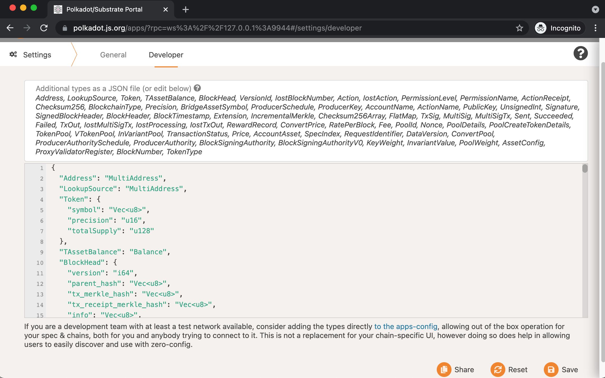
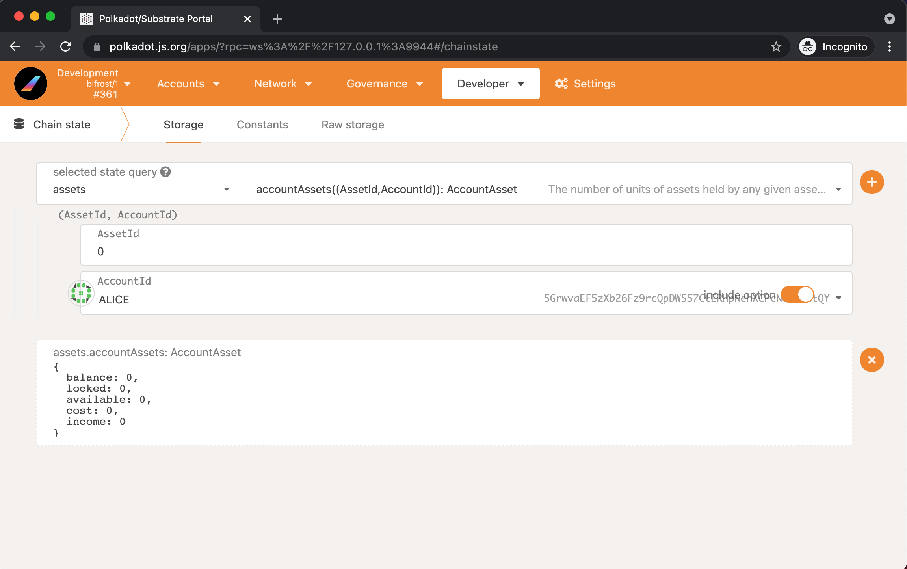
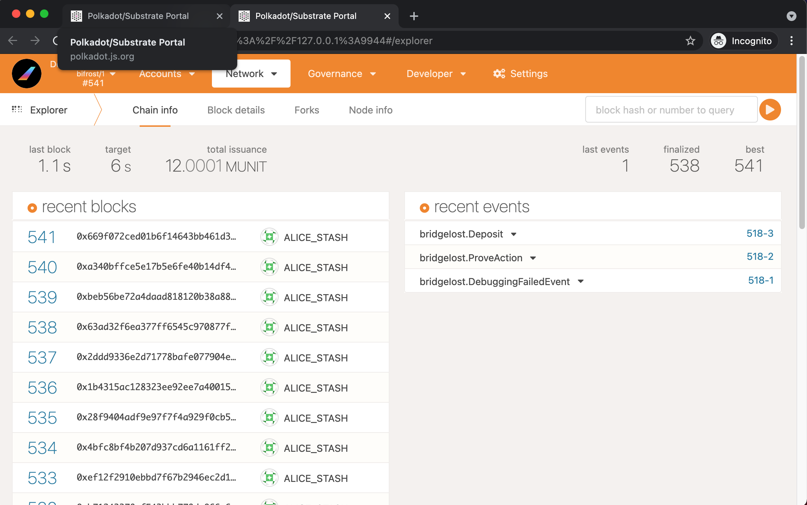
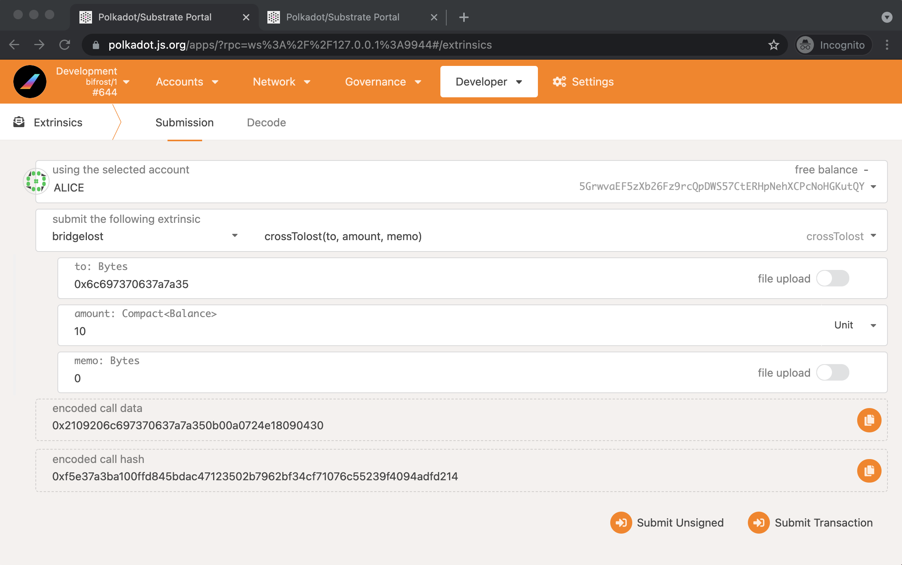
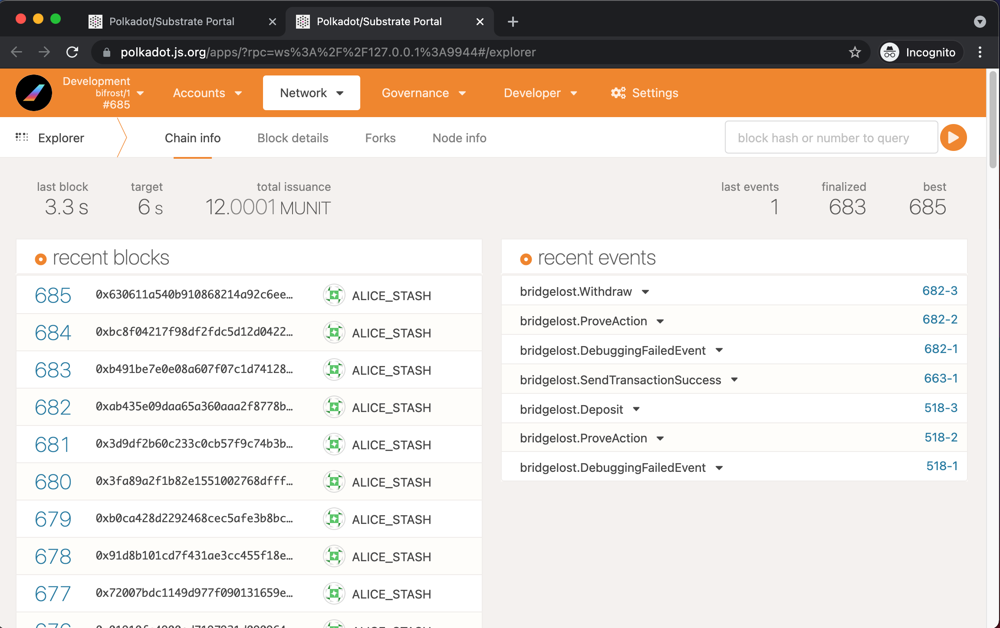
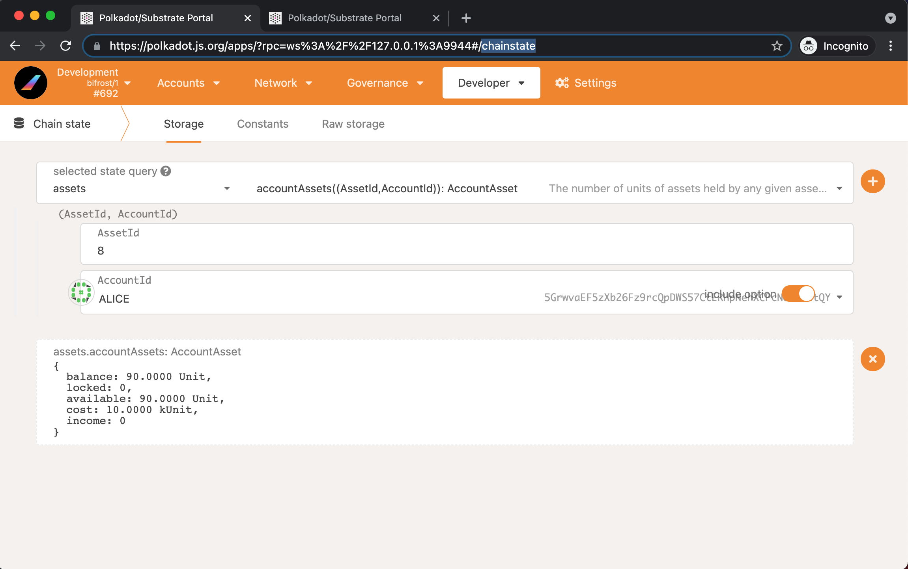

## All related repotories
- [bifrost](https://github.com/bifrost-finance/bifrost) (branch: develop)
- [rust-iost](https://github.com/bifrost-finance/rust-iost) (branch: master)
- [demux-js-iost](https://github.com/liebi-official/demux-js-iost) (branch: master)

## Bifrost

### 1. Compile
Follow the [readme](https://github.com/bifrost-finance/bifrost/tree/develop) to compile a bifrost node.
```
$ git clone https://github.com/bifrost-finance/bifrost.git
$ git checkout develop
$ cargo build --release
```

### 2. Run nodes

Start two Bifrost nodes.

Alice node:

```shell script
$ ./target/release/bifrost --base-path /tmp/alice \
--rpc-port 4321 \
--ws-port 9944 \
--chain=dev \
--alice \
--port 30333 \
--node-key 0000000000000000000000000000000000000000000000000000000000000001 \
--validator 

```

Bob node:

```shell script
$ ./target/release/bifrost --base-path /tmp/bob \  
--rpc-port 1234 \                                                                                                                      
--ws-port 9933 \                                                                                                                       
--bootnodes /ip4/127.0.0.1/tcp/30333/p2p/12D3KooWEyoppNCUx8Yx66oV9fJnriXwCcXwDDUA2kj6vnc6iDEp \            
--chain=dev \                                                                                                                          
--bob \                                                                                                                                
--port 30334 \                                                                                    
--validator  
```

Ensure both node are producing blocks and synchronizing each other.

## IOST

### 1. Build IOST
Follow the instructions to build [IOST](https://developers.iost.io/docs/en/4-running-iost-node/Building-IOST.html)


### 2. Launch local IOST server

Using the default config provided by IOST.

```shell script
$ iserver -f ./config/iserver.yml
```

- Follow the instructions to create accounts [Command Line Wallet Tool](https://developers.iost.io/docs/en/4-running-iost-node/iWallet.html).

1. Create account `bifrost` as the cross account of Bifrost - IOST.
2. Create account `lispczz5` as the test account.

**Tips**:
> While you're creating account for test, use the `--sign_algo secp256k1` to specify the sign algorithm as SECP256K1.

```shell script
$ iwallet --server 127.0.0.1:30002 --account admin --amount_limit "ram:1000|iost:10" --sign_algo secp256k1  account create lispczz5 --initial_balance 600 --initial_gas_pledge 10 --initial_ram 0
$ iwallet --server 127.0.0.1:30002 --account admin --amount_limit "ram:1000|iost:10" --sign_algo secp256k1  account create bifrost --initial_balance 200 --initial_gas_pledge 10 --initial_ram 0
```

> If don't have enough gas, using following command to issue more [Economic Contract](https://developers.iost.io/docs/en/6-reference/EconContract.html#pledgepledgor-to-amount).

```shell script
$ iwallet --account lispczz4 call 'gas.iost' 'pledge' '["lispczz5","lispczz5","10"]'
```

> Check the IOST chain status

```shell script
$ iwallet --server 127.0.0.1:30002 state      
```

## DEMUX-JS-IOST

### Configuration

Update the IOST endpoint in `index.js`, use the local IOST address `http://127.0.0.1:30001`.

Update the Bifrost address in `IostActionHandler.js`, use the local Bifrost address `ws://127.0.0.1:9944`.

Set the sign account to `Alice`.

```
  const keyring = new Keyring({ type: "sr25519" });
  const alice = keyring.addFromUri("//Alice", { name: "Alice default" });
```

### Run bridge node

```shell script

$ node index.js
```

## Configuration

### Configure Bifrost

Check the `bifrost` account information file in `~/.iwallet/bifrost.json`, and set the security key and algorithm in [subkey_setting_iost.sh](docs/iost/subkey_setting_iost.sh) as the raw_key and key_type of `bifrost`.

Execute the shell script, it will store necessary data into alice and bob's node.

```shell script
$ ./subkey_setting_iost.sh                     
Set local storage successfully
Set local storage successfully
Set local storage successfully
Set local storage successfully
Set local storage successfully
Set local storage successfully
Set local storage successfully
Set local storage successfully

```

### Configure Browser

Go to [polkadot.js.org](https://polkadot.js.org/apps/#/settings/developer), Copy content data from the file [developer_setting.json](./developer_setting.json) to **Deveoper** tab like this, and save it.



### Alice account balance in Bifrost




## Testing

### IOST to Bifrost

Before you send a transaction to Bifrost, check the IOST balance of account `bifrost` and `lispczz5`.

```shell script
$ iwallet --server 127.0.0.1:30002 balance lispczz5 | head -n 4
Connecting to server 127.0.0.1:30002 ...
{
    "name": "lispczz5",
    "balance": 600,

$ iwallet --server 127.0.0.1:30002 balance bifrost | head -n 4 
Connecting to server 127.0.0.1:30002 ...
{
    "name": "bifrost",
    "balance": 200,
```

Now send a transaction. `(5GrwvaEF5zXb26Fz9rcQpDWS57CtERHpNehXCPcNoHGKutQY is the Alice's address in Bifrost)`

```shell script
$ iwallet --account lispczz5 call 'token.iost' 'transfer' '["iost","lispczz5","bifrost","100","5GrwvaEF5zXb26Fz9rcQpDWS57CtERHpNehXCPcNoHGKutQY@bifrost:IOST"]'
```

Go to [polkadot.js.org](https://polkadot.js.org/apps/#/explorer), to check whether transaction is sent successfully to Bifrost or not.

Wait about 90 seconds for the transaction is verified. If all go well, you can see a event like the below screenshot.



If that event happens, Alice's assets will be created, the amount is 100(IOST asset id is 8), go to check Alice's assets that just created.


If you see that figure above, go to check the IOST balance of `bifrost` and `lispczz5` again.

```shell script
$ iwallet --server 127.0.0.1:30002 balance lispczz5 | head -n 4                                                                                                
Connecting to server 127.0.0.1:30002 ...
{
    "name": "lispczz5",
    "balance": 500,
```

```shell script
$ iwallet --server 127.0.0.1:30002 balance bifrost | head -n 4                                                                                                 
Connecting to server 127.0.0.1:30002 ...
{
    "name": "bifrost",
    "balance": 300,

```

### Bifrost to IOST


- Send transaction

Now, we can send a transaction to IOST node.

Follow the picture to send a transaction to IOST node `("lispczz5" to hex: "0x6c697370637a7a35")`.


Surely you can go to [polkadot.js.org](https://polkadot.js.org/apps/#/chainstate) to check Alice's assets change or not.

And you will see 10 Unit of Alice's asset are locked.


Wait a moment, a prove action and a withdraw event are shown in the recent events list.


Go back to check Alice's asset again.


Check the IOST balance of `lispczz5` and `bifrost` again.

```shell script
$ iwallet --server 127.0.0.1:30002 balance bifrost | head -n 4                                                                                                
Connecting to server 127.0.0.1:30002 ...
{
    "name": "bifrost",
    "balance": 290,

$ iwallet --server 127.0.0.1:30002 balance lispczz5 | head -n 4                                                                                               
Connecting to server 127.0.0.1:30002 ...
{
    "name": "lispczz5",
    "balance": 510,

```
