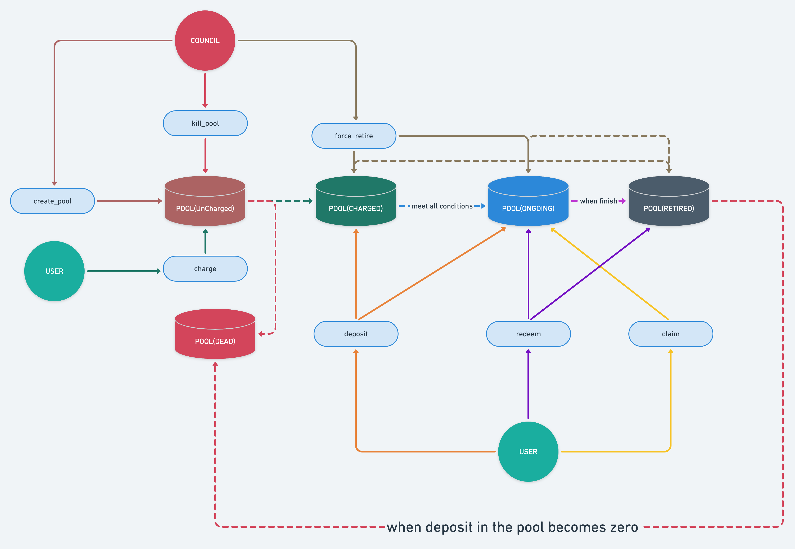

# Liquidity-Mining Pallet

###### Read this in other languages: English | [简体中文](./README_zh-CN.md)

The functionalities the pallet provides:
- creating, maintaining liquidity-pools, and managing the pool's lifecycle;
- users are permitted to do operations like `deposit to`/`redeem from`/`claim from` a liquidity-pool;
- maintaining the tokens the users have deposited;

__NOTE__: Permission to perform dangerous operations such as `create_*_pool`/`kill_pool`/`force_retire_pool`
can be set by `Config::ControlOrigin`.

## FLOW

In the graph above:
1. `council`, the authorized account, who are permitted to do operations such as `create_*_pool`/`kill_pool`/`force_retire_pool`;
2. `user` is the general account who are permitted to mining in a pool;
3. The blue box with ellipse corner refers to extrinsic of the pallet, the DB graph refers to the liquidity-pool;

### General Flow(The Pool)
1. The authorized account calls `create_*_pool` to create a liquidity-pool, which is at `Uncharged` state initially, 
must be charged before users are permitted to do mining operations.
   1. Want to delete the pool? Call `kill_pool` to kill the pool which is at `Uncharged` state, then recreate a new one;
2. Someone charges the pool has created above, which state will transform to `Charged`; Meanwhile, users are permitted to 
do `deposit` operation on the pool;
   1. Want to delete the pool?, Call `force_retire_pool` to retire the pool which is at `Charged`;
3. The moment the pool at `Charged` state meets the condition set when created, will transforms to `Ongoing`;
Meanwhile, users are permitted to do `deposit`/`redeem`/`claim` operations on the pool;
4. The pool will transform to `Retired` when it reaches the end of life, at the time, users are only permitted to do
`redeem` operation on the pool;
   1. Want to retire the ongoing-pool in advance? Call `force_retire_pool` to transform the state of it to `Retired`
   forcefully;
5. The pool will be deleted automatically when the deposit of it becomes zero;

### General Flow(The User)
1. When the pool is at `Charge` or `Ongoing` state, users are permitted to `deposit` tokens to it to participate in mining;
    1. __NOTE__: When the pool is at `Ongoing` state, the user will take the deserved rewards when deposit everytime;
2. When the pool is at `Ongoing` state, users are permitted to do:
    1. claim: withdraw the rewards but not redeem the tokens from the pool;
    2. redeem_*: redeem some(`redeem`) or all(`redeem_all`) tokens and withdraw the deserved rewards from the pool;
3. When the pool is at `Retired` state, 储户只能进行赎回(`redeem_*`)操作, 赎回所有质押的通证以及奖励;

## The Pools

1. `Mining`: Only accept depositing `LpToken`, the tokens will transfer to the pool keeper(module account) when do depositing;
2. `Farming`: Only accept depositing __free__ 1:1 `vsToken` and `vsBond`, the tokens will transfer to the pool keeper(module account) when do depositing;
3. `Early-Bird-Farming`: Only accept depositing __reserved__ 1:1 `vsToken` and `vsBond`, the tokens will still stay under the user account;

## The Method To Calculate Reward

### Terminology

- __PER_BLOCK__: 矿池每个区块释放的奖励数量;
    - 假设矿池总奖励数量(`total`)为10_000, 寿命(`duration`)为100区块, 那么`per_block = total/duration = 100`;
- __RDB(REWARD_PER_DEPOSIT_PER_BLOCK)__: 1单位的质押每区块可以获得奖励的数量;
    - 假设矿池`PER_BLOCK = 100`, 当前矿池中质押(`deposit`)数量为100, 那么`RDB = per_block / deposit = 1`;
- __RD(REWARD_PER_DEPOSIT)__: 1单位质押从矿池启动开始到现在, 可以获得奖励的数量;
    - 假设矿池`RDB = 1`且在20个区块内不变, 那么区块0时, `RD = 0`, 区块5时, `RD = 5`, 区块10时, `RD = 10`, ..依此类推;

### Example

假设当前区块高度为0, 已经创建了一个矿池A, 设计总奖励为10_000单位, 矿池寿命为100区块, 且该矿池已被充值(`Charged`);

1. 当块高为0时, 储户`Alice`质押(`deposit`)100单位的通证到矿池A;
2. 当块高为10时, 储户`Bob`质押(`deposit`)100个单位的通证到矿池A;
3. 当块高为15时, 储户`Alice`对矿池A进行`claim`操作, 领取了未结算的奖励;
4. 当块高为20时, 储户`Alice`对矿池A进行`redeem`操作, 赎回所有质押的通证, 并领取了未结算的奖励;

那么, `BLOCK`, `RDB`, `RD`, `RD_ALICE`, `RD_BOB`, `REWARD_ALICE`, `REWARD_BOB`之间的关系如下表所示:

| BLOCK | RDB | RD   | RD_ALICE | RD_BOB | REWARD_ALICE | REWARD_BOB |
| ----- | --- | ---- | -------- | ------ | ------------ | ---------- |
| 0     | 1   | 0    | 0        | none   | 0            | none       |
| 1     | 1   | 1    | 0        | none   | 100          | none       |
| 2     | 1   | 2    | 0        | none   | 200          | none       |
| 3     | 1   | 3    | 0        | none   | 300          | none       |
| 4     | 1   | 4    | 0        | none   | 400          | none       |
| 5     | 1   | 5    | 0        | none   | 500          | none       |
| 6     | 1   | 6    | 0        | none   | 600          | none       |
| 7     | 1   | 7    | 0        | none   | 700          | none       |
| 8     | 1   | 8    | 0        | none   | 800          | none       |
| 9     | 1   | 9    | 0        | none   | 900          | none       |
| 10    | 0.5 | 10   | 0        | 10     | 1000         | 0          |
| 11    | 0.5 | 10.5 | 0        | 10     | 1050         | 50         |
| 12    | 0.5 | 11   | 0        | 10     | 1100         | 100        |
| 13    | 0.5 | 11.5 | 0        | 10     | 1150         | 150        |
| 14    | 0.5 | 12   | 0        | 10     | 1200         | 200        |
| 15    | 0.5 | 12.5 | 12.5     | 10     | 0            | 250        |
| 16    | 0.5 | 13   | 12.5     | 10     | 50           | 300        |
| 17    | 0.5 | 13.5 | 12.5     | 10     | 100          | 350        |
| 18    | 0.5 | 14   | 12.5     | 10     | 150          | 400        |
| 19    | 0.5 | 14.5 | 12.5     | 10     | 200          | 450        |
| 20    | 1   | 15   | none     | 10     | none         | 500        |
| 21    | 1   | 16   | none     | 10     | none         | 600        |
| 22    | 1   | 17   | none     | 10     | none         | 700        |
| 23    | 1   | 18   | none     | 10     | none         | 800        |
| ..    | .   | ..   | .......  | ..     | ....         | ....       |
| 100   | 1   | 95   | none     | 10     | none         | 8500       |

__当块高100时, 矿池终结, 那么总计发放奖励为: 1250(alice claims) + 250(alice redeem) + 8500(bob owns) = 10_000__.

__NOTE__:
- `RD_ALICE`, `RD_BOB`指的是对应用户最近一次操作(`deposit`/`redeem`/`claim`)矿池A时, 矿池A的`RD`的数量;
- `REWARD_ALICE`, `REWARD_BOB`指的是对应用户应获得的奖励;