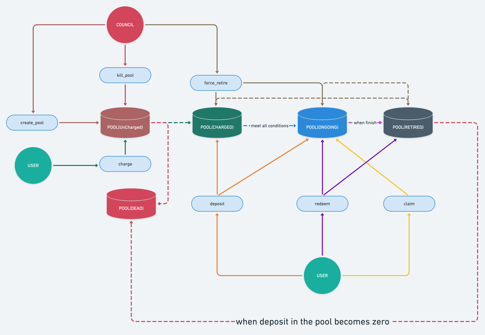

# Liquidity-Mining Pallet

使用其他语言阅读：[English](./README.md) | 简体中文

流动性挖矿模块主要提供:

-   矿池的`创建/维护`及`生命周期管理`;
-   挖矿功能, 储户可以用`质押(deposit)`/`赎回(redeem)`/`领取(claim)`等行为进行挖矿;
-   储户质押资产的维护;

**注意**: `创建矿池(create_*_pool)`/`终结矿池(kill_pool)`/`强停矿池(force_retire_pool)`等危险操作的权限可以通过
`Config::ControlOrigin`进行配置.

## 流程

在图中:

1.  `council`即为授权账户(`Config::ControlOrigin`), 拥有`创建矿池(create_*_pool)`/`终结矿池(kill_pool)`/`强停矿池(force_retire_pool)`的权限;
2.  `user`指一般账户, 可以参与挖矿;
3.  蓝色椭圆框指`模块函数`, 圆形指`参与者`, 数据库图形指`矿池`;

### 一般流程描述(矿池端)

1.  授权账户创建矿池(`create_*_pool`), 刚创建的矿池处于`Uncharged`状态, 需要有人充值设置的奖励;
    1.  若想要删除矿池, 可以终结(`kill_pool`)处于`Uncharged`状态的矿池, 然后重新创建;

2.  矿池的参与方对上述刚创建的矿池进行充值(`charge`), 此时矿池转变状态为`Charged`, 此时矿池接受储户的质押(`deposit`)操作;
    1.  若此时想要删除矿池, 可以强停(`force_retire_pool`)处于`Charged`状态的矿池(充值的资金会退回给参与者);

3.  当处于`Charged`的矿池满足条件(在创建矿池时设置的), 会自动转变状态为`Ongoing`, 此时矿池接受储户的赎回(`redeem`)/领取(`claim`)操作;

4.  当处于`Ongoing`的矿池到生命尽头, 会自动转变状态为`Retired`, 此时矿池只接受储户的赎回(`redeem`)操作;
    1.  若要提前`retire`掉处于`Ongoing`的矿池, 可以调用强停(`force_retire_pool`)操作, 矿池状态转换为`Retired`;

5.  当所有质押资金从矿池中赎回(`redeem`)后, 矿池将被自动删除;

### 一般流程描述(储户端)

1.  当矿池处于`Charged`或`Ongoing`状态时, 储户可以往里质押(`deposit`)矿池指定的通证, 参与挖矿;
    1.  **注意**: 当矿池处于`Ongoing`状态时, 储户每次质押(`deposit`)都会领取其未领取的奖励;

2.  当矿池处于`Ongoing`状态时, 储户可以:
    1.  claim: 在不动储户所质押的通证的前提下, 领取奖励;
    2.  redeem\_\*: 赎回部分(`redeem`)或全部(`redeem_all`)质押通证, 并领取奖励;

3.  当矿池处于`Retired`状态时, 储户只能进行赎回(`redeem_*`)操作, 赎回所有质押的通证以及奖励;

## 矿池

1.  `Mining`矿池: 只接受`LpToken`通证作为质押, 质押时对应的通证会转移到矿池的保管者账户(模块账户)中;
2.  `Farming`矿池: 只接受free状态下的1:1的`vsToken`与`vsBond`通证作为质押, 质押时对应的通证会转移到矿池的保管者账户(模块账户)中;
3.  `Early-Bird-Farming`矿池: 只接受reserved状态下的1:1的`vsToken`与`vsBond`通证作为质押, 质押时只进行记账, 通证仍然保留在储户的账户下;

## 奖励计算方式

### 术语

-   **PER_BLOCK**: 矿池每个区块释放的奖励数量;
    -   假设矿池总奖励数量(`total`)为10_000, 寿命(`duration`)为100区块, 那么`per_block = total/duration = 100`;

-   **RDB(REWARD_PER_DEPOSIT_PER_BLOCK)**: 1单位的质押每区块可以获得奖励的数量;
    -   假设矿池`PER_BLOCK = 100`, 当前矿池中质押(`deposit`)数量为100, 那么`RDB = per_block / deposit = 1`;

-   **RD(REWARD_PER_DEPOSIT)**: 1单位质押从矿池启动开始到现在, 可以获得奖励的数量;
    -   假设矿池`RDB = 1`且在20个区块内不变, 那么区块0时, `RD = 0`, 区块5时, `RD = 5`, 区块10时, `RD = 10`, ..依此类推;

### 举例

假设当前区块高度为0, 已经创建了一个矿池A, 设计总奖励为10_000单位, 矿池寿命为100区块, 且该矿池已被充值(`Charged`);

1.  当块高为0时, 储户`Alice`质押(`deposit`)100单位的通证到矿池A;
2.  当块高为10时, 储户`Bob`质押(`deposit`)100个单位的通证到矿池A;
3.  当块高为15时, 储户`Alice`对矿池A进行`claim`操作, 领取了未结算的奖励;
4.  当块高为20时, 储户`Alice`对矿池A进行`redeem`操作, 赎回所有质押的通证, 并领取了未结算的奖励;

那么, `BLOCK`, `RDB`, `RD`, `RD_ALICE`, `RD_BOB`, `REWARD_ALICE`, `REWARD_BOB`之间的关系如下表所示:

| BLOCK | RDB | RD   | RD_ALICE | RD_BOB | REWARD_ALICE | REWARD_BOB |
| ----- | --- | ---- | -------- | ------ | ------------ | ---------- |
| 0     | 1   | 0    | 0        | none   | 0            | none       |
| 1     | 1   | 1    | 0        | none   | 100          | none       |
| 2     | 1   | 2    | 0        | none   | 200          | none       |
| 3     | 1   | 3    | 0        | none   | 300          | none       |
| 4     | 1   | 4    | 0        | none   | 400          | none       |
| 5     | 1   | 5    | 0        | none   | 500          | none       |
| 6     | 1   | 6    | 0        | none   | 600          | none       |
| 7     | 1   | 7    | 0        | none   | 700          | none       |
| 8     | 1   | 8    | 0        | none   | 800          | none       |
| 9     | 1   | 9    | 0        | none   | 900          | none       |
| 10    | 0.5 | 10   | 0        | 10     | 1000         | 0          |
| 11    | 0.5 | 10.5 | 0        | 10     | 1050         | 50         |
| 12    | 0.5 | 11   | 0        | 10     | 1100         | 100        |
| 13    | 0.5 | 11.5 | 0        | 10     | 1150         | 150        |
| 14    | 0.5 | 12   | 0        | 10     | 1200         | 200        |
| 15    | 0.5 | 12.5 | 12.5     | 10     | 0            | 250        |
| 16    | 0.5 | 13   | 12.5     | 10     | 50           | 300        |
| 17    | 0.5 | 13.5 | 12.5     | 10     | 100          | 350        |
| 18    | 0.5 | 14   | 12.5     | 10     | 150          | 400        |
| 19    | 0.5 | 14.5 | 12.5     | 10     | 200          | 450        |
| 20    | 1   | 15   | none     | 10     | none         | 500        |
| 21    | 1   | 16   | none     | 10     | none         | 600        |
| 22    | 1   | 17   | none     | 10     | none         | 700        |
| 23    | 1   | 18   | none     | 10     | none         | 800        |
| ..    | .   | ..   | .......  | ..     | ....         | ....       |
| 100   | 1   | 95   | none     | 10     | none         | 8500       |

当块高100时, 矿池终结, 那么总计发放奖励为: 1250(alice claims) + 250(alice redeem) + 8500(bob owns) = 10_000;

**注意**:

-   `RD_ALICE`, `RD_BOB`指的是对应用户最近一次操作(`deposit`/`redeem`/`claim`)矿池A时, 矿池A的`RD`的数量;
-   `REWARD_ALICE`, `REWARD_BOB`指的是对应用户应获得的奖励;
